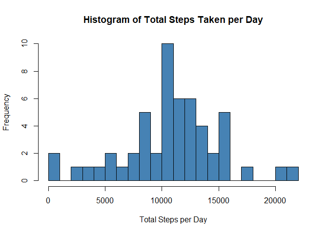
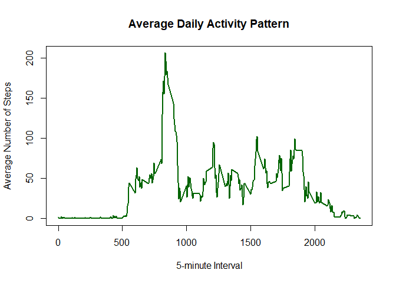
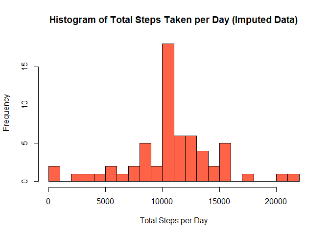
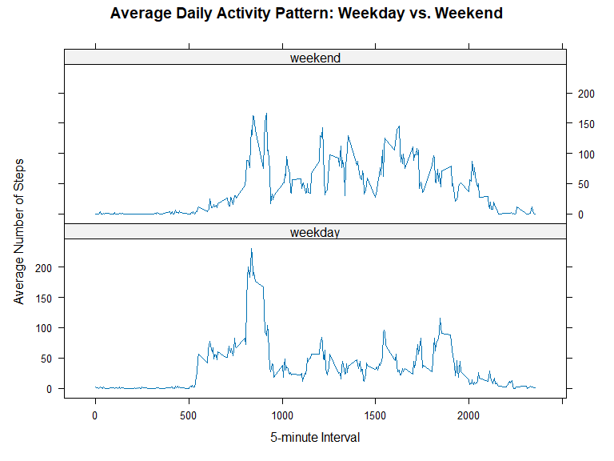

## Loading and preprocessing the data

The dataset for this assignment is included in the forked GitHub repository
as a zipped CSV file (`activity.zip`). We first unzip it (if needed) and
read it in with `read.csv()`.


``` r
## Unzip the data file if the CSV doesn't already exist
if (!file.exists("activity.csv") && file.exists("activity.zip")) {
  unzip("activity.zip")
}

## Read in the data
activity <- read.csv("activity.csv", stringsAsFactors = FALSE)

## Convert the date column from character to Date class
activity$date <- as.Date(activity$date, format = "%Y-%m-%d")

## Quick look at the structure of the data
str(activity)
```

```
## 'data.frame':	17568 obs. of  3 variables:
##  $ steps   : int  NA NA NA NA NA NA NA NA NA NA ...
##  $ date    : Date, format: "2012-10-01" "2012-10-01" ...
##  $ interval: int  0 5 10 15 20 25 30 35 40 45 ...
```

## What is mean total number of steps taken per day?

For this part of the analysis, we ignore missing values (`NA`s) in the dataset.

### Total number of steps taken per day


``` r
## Calculate total steps per day, removing NAs
totalStepsPerDay <- aggregate(steps ~ date, data = activity, FUN = sum, na.rm = TRUE)
names(totalStepsPerDay) <- c("date", "totalSteps")
head(totalStepsPerDay)
```

```
##         date totalSteps
## 1 2012-10-02        126
## 2 2012-10-03      11352
## 3 2012-10-04      12116
## 4 2012-10-05      13294
## 5 2012-10-06      15420
## 6 2012-10-07      11015
```

### Histogram of total steps taken each day


``` r
hist(
  totalStepsPerDay$totalSteps,
  main = "Histogram of Total Steps Taken per Day",
  xlab = "Total Steps per Day",
  col = "steelblue",
  breaks = 20
)
```

<!-- -->

### Mean and median of total steps taken per day


``` r
meanSteps <- mean(totalStepsPerDay$totalSteps)
medianSteps <- median(totalStepsPerDay$totalSteps)

meanSteps
```

```
## [1] 10766.19
```

``` r
medianSteps
```

```
## [1] 10765
```

The mean total number of steps taken per day is **10,766.19**,
and the median total number of steps taken per day is
**10,765**.

## What is the average daily activity pattern?

### Time series plot of average steps per interval


``` r
## Calculate the average number of steps per interval, across all days
avgStepsPerInterval <- aggregate(steps ~ interval, data = activity, FUN = mean, na.rm = TRUE)
names(avgStepsPerInterval) <- c("interval", "avgSteps")

plot(
  avgStepsPerInterval$interval,
  avgStepsPerInterval$avgSteps,
  type = "l",
  xlab = "5-minute Interval",
  ylab = "Average Number of Steps",
  main = "Average Daily Activity Pattern",
  col = "darkgreen",
  lwd = 2
)
```

<!-- -->

### Interval with the maximum average number of steps


``` r
maxInterval <- avgStepsPerInterval$interval[which.max(avgStepsPerInterval$avgSteps)]
maxInterval
```

```
## [1] 835
```

The 5-minute interval that, on average across all days, contains the maximum
number of steps is interval **835**.

## Imputing missing values

### Total number of missing values


``` r
totalNA <- sum(is.na(activity$steps))
totalNA
```

```
## [1] 2304
```

There are **2304** rows with missing (`NA`) step values in the dataset.

### Strategy for imputing missing values

Our strategy is to fill in each missing value with the **mean number of
steps for that 5-minute interval**, calculated across all days (the
`avgStepsPerInterval` table computed above). This preserves the average
daily activity pattern while removing missing data.

### Create a new dataset with missing values filled in


``` r
## Copy the original data
activityImputed <- activity

## Merge in the interval averages to look up replacement values easily
imputedSteps <- merge(activityImputed, avgStepsPerInterval, by = "interval", sort = FALSE)

## Reorder to match original row order (merge can shuffle rows)
imputedSteps <- imputedSteps[order(imputedSteps$date, imputedSteps$interval), ]

## Replace NA step values with the interval average
imputedSteps$steps <- ifelse(
  is.na(imputedSteps$steps),
  imputedSteps$avgSteps,
  imputedSteps$steps
)

## Keep only the original three columns, in original order
activityImputed <- imputedSteps[, c("steps", "date", "interval")]

## Confirm there are no more missing values
sum(is.na(activityImputed$steps))
```

```
## [1] 0
```

### Histogram of total steps per day (imputed data)


``` r
totalStepsPerDayImputed <- aggregate(steps ~ date, data = activityImputed, FUN = sum)
names(totalStepsPerDayImputed) <- c("date", "totalSteps")

hist(
  totalStepsPerDayImputed$totalSteps,
  main = "Histogram of Total Steps Taken per Day (Imputed Data)",
  xlab = "Total Steps per Day",
  col = "tomato",
  breaks = 20
)
```

<!-- -->

### Mean and median of total steps per day (imputed data)


``` r
meanStepsImputed <- mean(totalStepsPerDayImputed$totalSteps)
medianStepsImputed <- median(totalStepsPerDayImputed$totalSteps)

meanStepsImputed
```

```
## [1] 10766.19
```

``` r
medianStepsImputed
```

```
## [1] 10766.19
```

The mean total number of steps per day using the imputed dataset is
**10,766.19**, and the median is
**10,766.19**.

**Do these values differ from the estimates in the first part of the assignment?**
Comparing to the original values (mean = 10,766.19,
median = 10,765), the mean is essentially
unchanged, since we imputed using interval means, which by construction do
not shift the overall average. The median shifts very slightly, moving
closer to the mean, because imputing adds additional data points at each
interval's average value rather than leaving those days as `NA` (which were
previously excluded from the sum). Overall, imputing missing data using
interval averages has a small effect on the estimates of total daily steps:
it slightly increases the total step counts on days that previously had
missing intervals, but does not meaningfully change the central tendency of
the data.

## Are there differences in activity patterns between weekdays and weekends?

### Create a weekday/weekend factor variable


``` r
activityImputed$dayType <- factor(
  ifelse(
    weekdays(activityImputed$date) %in% c("Saturday", "Sunday"),
    "weekend",
    "weekday"
  ),
  levels = c("weekday", "weekend")
)

table(activityImputed$dayType)
```

```
## 
## weekday weekend 
##   12960    4608
```

### Panel plot: average steps per interval, weekday vs weekend


``` r
library(lattice)

## Calculate average steps per interval, split by day type
avgByIntervalDayType <- aggregate(
  steps ~ interval + dayType,
  data = activityImputed,
  FUN = mean
)

xyplot(
  steps ~ interval | dayType,
  data = avgByIntervalDayType,
  type = "l",
  layout = c(1, 2),
  xlab = "5-minute Interval",
  ylab = "Average Number of Steps",
  main = "Average Daily Activity Pattern: Weekday vs. Weekend"
)
```

<!-- -->

Looking at the panel plot, activity on weekdays tends to show a sharper peak
in the morning (consistent with a morning commute or exercise routine),
while weekend activity is more spread out across the day with somewhat
higher activity levels in the mid-morning through afternoon hours. This
suggests the individual is more sedentary during weekday work hours and more
active throughout the day on weekends.
